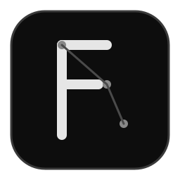

<div align="center">



# FloatingAI


**一个常驻桌面的悬浮式 AI 助手。**  
把聊天入口放在屏幕边缘：需要时随手呼出，不需要时尽量不打扰当前工作流。

</div>

## 概览

- 悬浮球常驻桌面，可拖动并记忆位置
- 发送后流式返回结果，支持中途停止
- 支持 Markdown、代码高亮和 LaTeX 公式渲染
- 内置语音转写输入（STT）
- 支持全局快捷键、托盘菜单、开机自启动、始终置顶

## 快速开始

### 下载安装

从 [Releases](https://github.com/LennyFace24/FloatingAI/releases) 下载对应平台安装包：

- **Windows**：`FloatingAI-windows-x64...setup.exe`
- **macOS**：`.dmg` / `.app`
- **Linux**：`.deb` / `.AppImage`

### 初次配置

在设置页填写以下信息即可开始使用：

- API Key（仅保存在本地）
- Base URL（默认 `https://api.openai.com/v1`，兼容 OpenAI 接口）
- 模型名称（默认 `gpt-4o-mini`）

## 使用方式

| 操作 | 效果 |
| --- | --- |
| 拖动悬浮球 | 移动悬浮球并自动保存位置 |
| 点击悬浮球 | 展开输入条 |
| `Enter` | 发送消息 |
| `Shift+Enter` | 输入框换行 |
| `Esc` | 按阶段收起（输入条 → 悬浮球 → 隐藏） |
| `Alt+Space` | 全局唤起 / 收起聊天面板（默认） |
| 输入条 `🎤` | 开始 / 停止语音转写（最长 60 秒） |
| 输入条 `⚙` | 打开设置页 |
| 托盘左键 | 直接唤起聊天面板 |
| 托盘右键 | 显示 / 设置 / 隐藏 / 退出 |

## 功能细节

### 聊天体验

- 流式输出，支持随时停止
- 回复面板高度随内容自适应
- 回复结束后保留输入框，便于连续追问

### 渲染能力

- Markdown（GFM）
- 代码高亮（含复制按钮）
- LaTeX 公式（KaTeX）

### 语音输入

- 输入条麦克风按钮触发实时转写
- 可选 OpenAI 兼容接口或小米 MiMo（`mimo-v2.5-asr`）
- 可单独配置 STT API Key、模型、语言

## 配置项

| 项 | 默认值 | 说明 |
| --- | --- | --- |
| API Key | 空 | 聊天接口密钥（本地保存） |
| Base URL | `https://api.openai.com/v1` | OpenAI 兼容接口地址 |
| 模型 | `gpt-4o-mini` | 聊天模型名称 |
| 语音服务类型 | OpenAI 兼容 | OpenAI 兼容或小米 MiMo |
| STT Base URL | `https://api.openai.com/v1` | 语音识别接口地址（MiMo 使用官方地址） |
| STT 模型 | `whisper-1` / `mimo-v2.5-asr` | 随语音服务类型切换 |
| STT API Key | 空 | 语音专用密钥；留空时复用 API Key |
| STT 语言 | `auto` | 例如 `zh`，默认自动检测 |
| 全局快捷键 | `Alt+Space` | 修改后立即生效 |
| 开机自启动 | 关 | 登录时自动启动 |
| 始终置顶 | 开 | 保持窗口置顶 |

## 开发

### 环境要求

- [Node.js](https://nodejs.org/) ≥ 22（建议 24）
- [pnpm](https://pnpm.io/) ≥ 10
- [Rust](https://rustup.rs/) stable
- Linux 额外依赖：`libwebkit2gtk-4.1-dev`、`libappindicator3-dev`、`librsvg2-dev`、`patchelf`

### 本地运行

```bash
pnpm install
pnpm tauri dev
```

### 测试

```bash
pnpm test
cargo test --manifest-path src-tauri/Cargo.toml
```

### 构建

```bash
pnpm tauri build
```

## 技术栈

- Tauri 2
- React + TypeScript + Vite
- react-markdown + Prism + KaTeX
- Tauri Store（本地设置持久化）

## Roadmap

- [ ] 提供更完整的安装与使用演示素材
- [ ] 完善更多平台下的使用体验细节
- [ ] 持续优化窗口交互与稳定性

## Contributing

欢迎提交 Issue 和 PR。  
在贡献前，建议先阅读现有代码结构，并在本地通过测试后再提交。

## License

MIT
