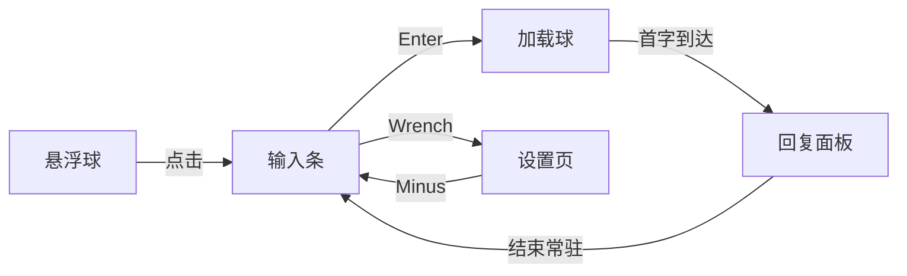

# Floating AI

一个常驻桌面的 AI 助手：悬浮球随身待命，底部锚定输入条，流式回答直接渲染 Markdown、代码块与 LaTeX 公式。纯黑灰 Graphite Terminal 风格，无渐变、无装饰、不打扰。


## 功能

- **悬浮球**：50×50 悬浮球常驻屏幕任意位置，原生跟手拖动，位置自动记忆
- **底部锚定交互流**：点击悬浮球展开输入条 → 发送后变为加载球 → 首字到达展开回复面板 → 回复结束底部常驻输入框，随时追问
- **流式聊天**：逐字输出，支持随时停止；回复面板高度自适应内容
- **Markdown / 代码高亮 / LaTeX**：公式用 KaTeX 渲染，代码块带复制按钮
- **设置页**：单窗口动态过渡（进入/返回都有窗口动画），打开时自动夹紧在工作区内
- **全局快捷键**：默认 `Alt+Space` 一键唤起/收起
- **托盘菜单**：显示 / 设置 / 隐藏 / 退出；左键单击托盘图标直接唤起聊天
- **开机自启动**：可选
- **始终置顶**：可选，默认开启
- **Graphite Terminal 美学**：纯黑灰、无渐变、无毛玻璃、无发光

## 使用

| 操作 | 效果 |
| --- | --- |
| 拖动悬浮球 | 移动悬浮球，位置自动保存 |
| 点击悬浮球 | 展开为输入条 |
| `Enter` | 发送消息 |
| `Shift+Enter` | 输入框内换行 |
| `Esc` | 按阶段收起（输入条 → 悬浮球 → 隐藏） |
| 输入条左侧 `⚙` | 打开设置页 |
| 输入条左侧 `-` | 收起为悬浮球 |
| `Alt+Space` | 全局唤起/收起聊天面板 |
| 托盘左键单击 | 唤起聊天面板 |
| 托盘右键菜单 | 显示 / 设置 / 隐藏 / 退出 |

## 安装

从 [Releases](https://github.com/LennyFace24/FloatingAI/releases) 下载对应平台与架构的安装包：

- **Windows**：`FloatingAI-windows-x64...setup.exe`（NSIS 安装器）
- **macOS**：`.dmg` / `.app`
- **Linux**：`.deb` / `.AppImage`

## 配置

设置页中可配置：

| 项 | 默认值 | 说明 |
| --- | --- | --- |
| API Key | 空 | 服务端 API 密钥（仅本地保存） |
| Base URL | `https://api.openai.com/v1` | OpenAI 兼容接口地址，可指向任意兼容服务 |
| 模型 | `gpt-4o-mini` | 模型名称 |
| 全局快捷键 | `Alt+Space` | 修改后立即生效 |
| 开机自启动 | 关 | 登录时自动启动 |
| 始终置顶 | 开 | 窗口保持在所有窗口之上 |

## 开发

### 环境要求

- [Node.js](https://nodejs.org/) ≥ 22（建议 24）
- [pnpm](https://pnpm.io/) ≥ 10
- [Rust](https://rustup.rs/)（stable）
- 平台依赖：Windows 需要 WebView2（系统自带）；Linux 需要 `libwebkit2gtk-4.1-dev`、`libappindicator3-dev`、`librsvg2-dev`、`patchelf`

### 启动

```bash
pnpm install
pnpm tauri dev
```

### 测试

```bash
pnpm test        # 前端（Vitest）
cargo test --manifest-path src-tauri/Cargo.toml   # Rust
```

### 构建

```bash
pnpm tauri build
```

## 技术栈

- **框架**：[Tauri 2](https://tauri.app/) + React 18 + TypeScript + Vite
- **窗口**：单 `floating` 窗口承载全部表面（悬浮球 / 输入条 / 加载球 / 回复 / 设置），Rust 侧持有边界与状态机，前端只发离散状态与内容高度
- **动画**：原生 `SetWindowPos` 驱动窗口形变（放大路径使用窗口 Region 裁剪，避免 Chromium tile 逐块渲染），`ease-out` 缓动，支持 `prefers-reduced-motion` 直接跳转
- **渲染**：Markdown（react-markdown）、代码高亮（Prism）、公式（KaTeX）
- **存储**：Tauri Store 插件保存设置与悬浮球位置

## 架构



窗口状态机：`Floating → Prompt → Waiting → Response ⇄ Settings`，所有过渡由 Rust 原生窗口动画驱动，切换可中断、可回滚。

## 许可证

MIT
